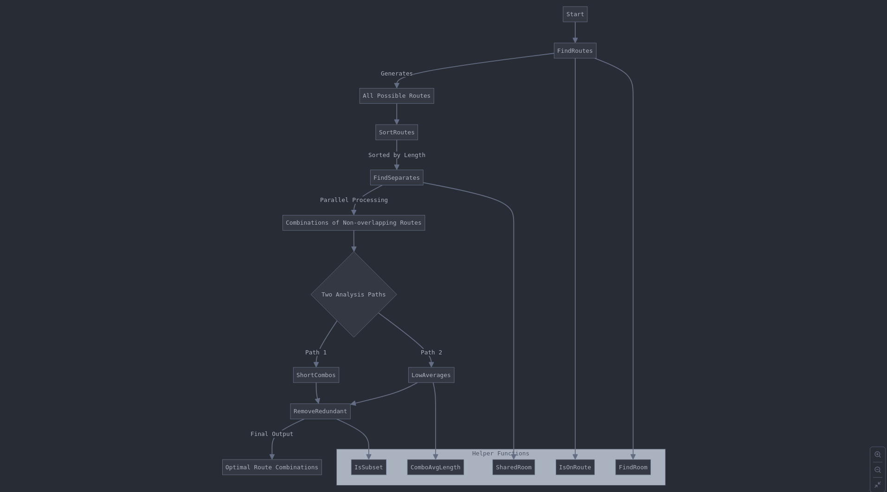
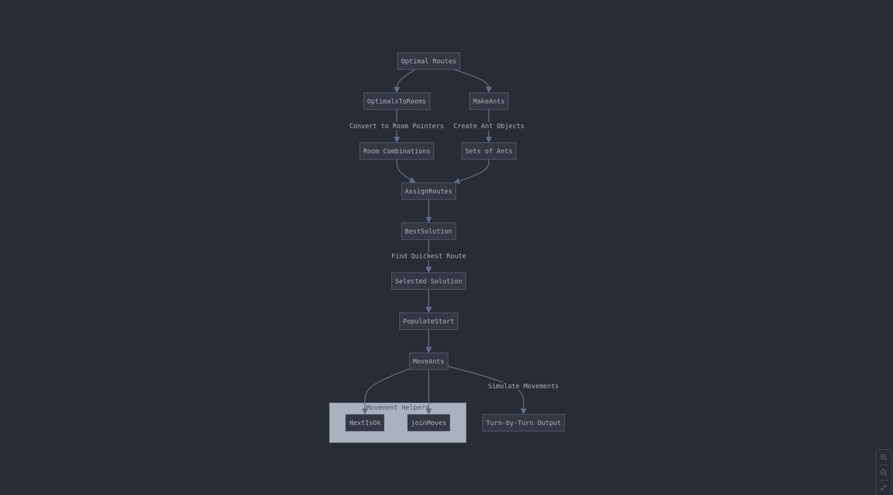

# Lem-in

## About
Lem-in is a pathfinding simulation that moves ants through an interconnected network of rooms. The program finds optimal paths to move all ants from a start room to an end room while minimizing the total number of turns required.

## Features
- Graph-based pathfinding using depth-first search (DFS)
- Parallel processing for route optimization
- Multiple route combination analysis
- Efficient ant movement simulation
- Input validation and error handling

## Input Format
The program expects input in the following format:

```
number_of_ants
room_definitions
room_connections
```

### Example Input:
```
10
##start
start 0 0
room1 1 1
room2 2 2
##end
end 3 3
start-room1
room1-room2
room2-end
```

## Core Components

### Room Management
Each room contains:
- Name (unique identifier)
- Coordinates (x, y)
- Links to other rooms
- Role (start, end, or normal)

### Data Structures
```go
type Room struct {
    name     string
    x, y     int
    links    []*Room
    role     RoomRole
}

type Ant struct {
    name       string
    route     *Route
    roomIndex  int
    finished   bool
}

type Route []string
```

## Algorithm Flow

### 1. Input Processing
- Read ant count
- Parse room definitions
- Validate connections

### 2. Route Discovery
- Find all possible paths using DFS
- Sort routes by length
- Identify non-overlapping combinations
- Select optimal route sets

### 3. Optimization Process
1. Calculate average lengths
2. Remove redundant paths
3. Select best combinations

### 4. Movement Simulation
```go
func MoveAnts(ants []*Ant) []string {
    moves := []string{}
    for !allFinished(ants) {
        turnMoves := []string{}
        for _, ant := range ants {
            if NextIsOk(ant) {
                // Move ant and record move
                turnMoves = append(turnMoves, makeMove(ant))
            }
        }
        moves = append(moves, joinMoves(turnMoves))
    }
    return moves
}
```

## Output Format
Movement sequences are displayed as:
```
L1-room1 L2-room2
L1-room2 L2-end L3-room1
L1-end L3-room2 L4-room1
```

Where:
- Each line represents one turn
- Format: `L[ant_number]-[room_name]`

## Functions Reference

### Main Functions

#### FindRoutes
```go
func FindRoutes(curRoom *Room, curRoute []string, routes *[][]string, rooms *[]*Room) {
    if curRoom.role == END {
        *routes = append(*routes, append([]string{}, curRoute...))
        return
    }
    for _, link := range curRoom.links {
        if !IsOnRoute(link.name, curRoute) {
            FindRoutes(link, append(curRoute, link.name), routes, rooms)
        }
    }
}
```

#### BestSolution
```go
func BestSolution(optimals [][]*Room, setsOfAnts [][]*Ant) int {
    minTurns := math.MaxInt32
    bestIndex := 0
    
    for i, combo := range optimals {
        turns := simulateMoves(combo, setsOfAnts[i])
        if turns < minTurns {
            minTurns = turns
            bestIndex = i
        }
    }
    return bestIndex
}
```

## Error Handling
The program validates:
- Existence of start and end rooms
- Duplicate room names
- Valid room connections
- Number of ants (must be positive)

Error messages include:
- "No start room defined"
- "No end room defined"
- "Duplicate room name: {name}"
- "Invalid room connection"

## Performance

### Optimizations
- Parallel route combination processing
- Early termination of invalid paths
- Efficient room pointer usage
- Route sorting for faster processing

### Complexity
- Route finding: O(V + E) where V = vertices, E = edges
- Route sorting: O(n²) where n = number of routes
- Movement simulation: O(a * t) where a = ants, t = turns

## Implementation Notes
- Uses depth-first search for pathfinding
- Implements bubble sort for route ordering
- Employs WaitGroups for goroutine synchronization
- Maintains room pointers for efficient movement tracking

## Project Timeline
Below are diagrams illustrating the project's pipeline:

### Ant Farm Program Pipeline



### Ant Movement and Assignment Pipeline


